# 3 MB 装下一个「AI 大脑」：231 万参数端侧语言模型从训练、16x8 量化到 openvela 部署全实录

> 关键词：端侧 LLM · TFLite Micro · LSTM 语言模型 · 16x8 混合精度量化 · SentencePiece BPE · openvela / NuttX · SF32LB52 MCU

---

## 一、先说结论：这颗「小脑」到底有多小

在绝大多数人的认知里，「大模型」是和「云」绑定在一起的：动辄几十 GB 的权重、数千瓦的 GPU、按 token 计费的 API。但在 2026 年的今天，端侧 AI 已经把战场推到了新的极限——**在一颗 120 MHz 的 Cortex-M4F 单片机（512 KB SRAM、16 MB NOR Flash）上，跑一个 231 万参数、体积仅 3 MB 的语言模型**，从「开灯」「调空调」到「现在几点了」「今天天气怎么样」，完全离线、毫秒级响应（单轮端到端约 9 秒，其中大部分还是 UI 与进程开销）。

本文记录这个模型从 0 到 1 的全过程：**数据工程 → BPE 分词器 → 面向 TFLM 的架构设计 → GPU 训练 → 16x8 量化 → 部署进 openvela 系统**，以及一路上踩过的每一个坑——很多坑都是「文档里查不到、只有烧到板子上才暴露」的那种。

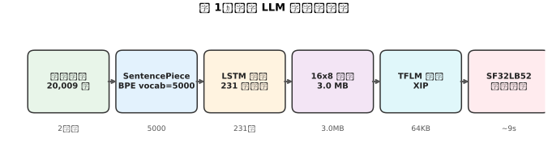

---

## 二、目标硬件与约束：一切设计的出发点

我们的目标是 **SF32LB52-DevKit-LCD 开发板**（思澈科技 SF32LB52 芯片），运行 openvela（基于 NuttX 的开源嵌入式操作系统）。它是一块典型的穿戴/物联网级硬件，资源极其紧张：

| 资源 | 规格 | 对模型的含义 |
|---|---|---|
| CPU | ARM Cortex-M4F @ 120 MHz | 没有硬件加速器，推理全靠 CPU 裸算 |
| SRAM | 512 KB（实测可用更少） | 模型权重不能进 SRAM，推理工作区必须以 KB 计 |
| PSRAM | 8 MB | 可以放临时数据，但访问速度慢于 SRAM |
| NOR Flash | 16 MB（XIP 片外执行） | 权重放在 Flash 直接 XIP 执行，这就是 3 MB 模型的安身之处 |
| 屏幕/触控/麦克风 | 390×450 LCD + 麦克风 | 最终交互形态是「看得见、说得出」的桌宠 |

换算一下：**231 万参数 × 1 字节（int8）= 2.3 MB 权重**，加上 embedding 表（5000×128）与算子开销，整个模型 3.0 MB，全部塞进 Flash 的只读段（RODATA）用 XIP 跑；而运行时的工作区（Tensor Arena）实测只要 **37.8 KB**，配置 64 KB 就绰绰有余。这就是整个项目可行性的根：**模型大不大不重要，重要的是它能不能塞进 Flash、以及跑的时候占不占 SRAM。**

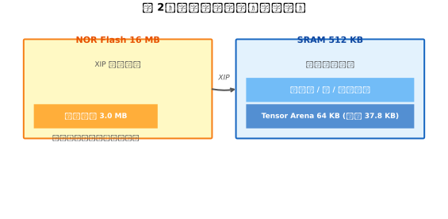

---

## 三、数据工程：先有 2 万条「智能家居 Agent 对话」

语言模型是「吃数据长大」的，端侧小模型尤其如此——它的容量小，容错也小，数据质量直接决定天花板。我们没有去网上抓语料，而是**用模板程序化地生成了一份高质量的智能家居 Agent 对话数据集**，并且把它迭代了三代：

| 版本 | 数据量 | 词表 | 覆盖 | val acc | 说明 |
|---|---|---|---|---|---|
| V1 | 413 条 | 2000 | 13 类场景 | 0.6737 | 全流程跑通，语义正确率仅 ~40% |
| V2 | 2716 条 | 2500 | 房型 20、频道 18、15 档温度 | 0.8173 | 加正则/调度/早停，容量 96→256 |
| **V3** | **20009 条**（train 18008 / val 2001） | **5000** | 房型 30、城市 40、频道 36、流派 24、新设备 5 种、组合指令 | **0.8705** | 最终部署版本 |

V1 的教训非常直接：413 条数据对 48 万参数，模型只能「背题」，房间名错配（主卧↔卫生间）、时间查询被误拒，语义正确率只有 40%。**数据量是端侧模型的第一杠杆。**

### 3.1 一条训练样本长什么样

数据集的核心是一条完整的 Agent 对话序列，格式与训练目标完全一致：

```
<usr> 把卧室空调调到26度 <call> set_ac <arg> 卧室 <arg> 26 </tool> <obs> success <bot> 好的，卧室空调已设为26度 <eos>
```

这不是普通的「问答对」，而是一个**带工具调用闭环的完整事件流**：

- `<usr>`：用户请求（语音/文字转写结果）
- `<call>`：模型应当输出的工具调用（工具名 + `<arg>` 槽位）
- `<obs>`：工具执行后的观测结果（成功/失败/数值）
- `<bot>`：基于观测生成的最终自然语言回复
- `<eos>`：序列结束符

V3 覆盖的对话类型包括：灯光（5 种灯型 × 30 房型）、空调（开关/15 档调温/4 种模式）、窗帘、电视（36 频道）、音乐（24 流派）、门锁（含权限拒绝）、设备状态查询、定时提醒、天气（40 城市 × 10 种天气）、时间、温度、组合指令（灯+空调同开），以及**大量「未配置工具」的拒绝样本**（帮我发射火箭、帮我转账、帮我写代码……）——让模型学会诚实地说「做不到」。

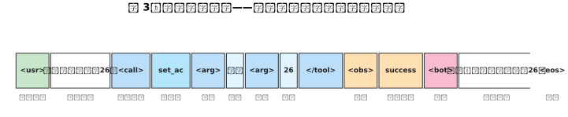

### 3.2 数据质量的三道闸门

模板生成看似简单，但 2 万条数据里藏着大量隐性问题，我们做了三道自动校验：

1. **格式校验**：每条必须完整匹配 `<usr> ... <call> ...</tool> <obs> ... <bot> ... <eos>` 的正则，0 格式错误；
2. **槽位一致性校验**：`<call>` 里的房间/数值必须与 `<bot>` 回复里出现的完全一致（`{r}{r}` 这种模板拼接 bug 就是这么抓出来的）；
3. **重复与语义冲突校验**：同一序列只出现一次；「我难受」这种既能被拒绝工具匹配、又被闲聊模板覆盖的歧义样本，直接移除。

**经验：模板生成数据省力，但校验代码必须比生成代码更严格——数据集的 bug 会原封不动地变成模型的 bug，而且极难定位。**

---

## 四、分词器：SentencePiece BPE 与「逐位一致」的 C 端复刻

### 4.1 训练侧分词器

我们用 SentencePiece 训练了一个 **BPE 分词器**（vocab 5000，`character_coverage=1.0` 保证所有出现过的字符入表），关键配置：

- `normalization_rule_name='identity'`：保留中文标点，不做全角→半角归一化；
- `split_by_unicode_script=False`：让 BPE 自由合并中文子词（而非按汉字逐字切）；
- 特殊 token 用 `user_defined_symbols` 接管并**固定 ID 顺序**：`<pad>=0, <unk>=1, <eos>=2, <usr>=3, <bot>=4, <call>=5, <arg>=6, </tool>=7, <obs>=8`。ID 顺序在部署侧被硬编码引用，是模型与运行时之间的「协议」；
- V3 语料 UNK 率 0%（词表覆盖全部字符）。

### 4.2 MCU 侧：把 BPE 算法逐位复刻成 C

板子上不可能跑 Python 的 sentencepiece 库，必须在 C 里实现分词。**这是整个项目里最隐蔽、杀伤力最大的坑之一**：

第一版我们用「贪心最长匹配」实现——词表里哪个 piece 最长就先切哪个。跑 demo 看起来一切正常，但换到真实语料就发现**模型回复质量莫名下降**。逐条对比后真相大白：贪心匹配和 BPE 的合并顺序**根本不等价**。比如：

| 输入 | 贪心最长匹配（错误） | SP 正确切分 |
|---|---|---|
| `▁今天天气怎么样` | `▁今天` + `天气` + `怎么样` | `▁` + `今天天气怎么样` |
| `周杰伦`（"杰伦"不在词表） | `周` + `<unk>` + `<unk>` | `周` + `<unk>`（连续未知合并） |

分布外（OOD）的 prompt 分词结果喂给模型，等于把模型推到它没见过的输入分布上，输出自然变差。

于是我们**按 SentencePiece 的 BPE 算法完整重写**：去首尾空白/压缩连续空白 → 空格转义为 `▁`（U+2581）→ 用户定义符号作原子 → 段内反复合并「拼接结果 id 最小」的相邻符号对（SP 词表 score = -(id-9)，**id 序即合并优先级，不是 score 最大**）→ 连续未知符合并为单个 `<unk>`。并用 FNV-1a 哈希把 5000 个 piece 做成静态查找表。

验证方式：**把 velaAI 全部语料（corpus_v3 20009 条 + train_v3 18008 条，共 38017 条）逐条与 sentencepiece 的输出做逐位比对，全部一致**，才敢上板。

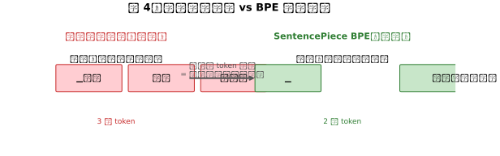

**经验：自实现分词器必须用训练侧全量数据做逐 token 比对验证。「几个 demo 一致」不代表一致——宁可花一晚上写验证脚本，也不要花一周在真机上猜为什么回复变傻了。**

---

## 五、模型架构：每一个算子都为 TFLM 而生

### 5.1 为什么不能用「标准」的 LSTM 语言模型

直觉上，一个语言模型就是 `Embedding → LSTM(return_sequences=True) → Dense`。我们第一版就这么干的，然后发现它在 TFLM 16x8 量化下**根本走不通**，三个坑全部实测复现：

1. `return_sequences=True` 导出的 `UNIDIRECTIONAL_SEQUENCE_LSTM` 算子**没有 16x8 量化内核，TFLM 也没有对应内核**；
2. 16x8 转换器会给 int32 输入自动插入 `CAST` 节点，而 **16x8 量化不支持 CAST**；
3. 想走 QAT（量化感知训练）？`tensorflow-model-optimization` 默认**不支持 Embedding 和 LSTM 层**。

结论：**架构必须从一开始就按部署目标设计，而不是先训一个「正常」模型再想办法转换。**

### 5.2 多 IO 显式状态单步模型：TFLM 的官方姿势

最终方案是 TFLM 官方推荐的 **显式状态（explicit state）单步 unroll** 模式：

```
输入:  token (1,1) int32,  c_in (1,256) f32,  h_in (1,256) f32
模型:  Embedding → LSTM(return_sequences=False, return_state=True) → Dense(softmax)
输出:  logits (1,5000) f32,  h_out (1,256) f32,  c_out (1,256) f32
```

- **推理时外部循环维护 c/h**：每生成一个 token，把上一个时刻的 `h_out/c_out` 喂回 `h_in/c_in`，自回归 argmax，遇到 `<eos>` 立即早停——不浪费 MCU 的一丝算力；
- **LSTM 被导出为单步展开的基础算子**：GATHER / FULLY_CONNECTED / SOFTMAX / SPLIT / UNPACK / TANH / LOGISTIC / MUL / ADD / QUANTIZE / DEQUANTIZE，**全部在 TFLM 支持列表内，不需要 LSTM 专用内核**；
- 训练侧用 `return_sequences=True` 的完整序列模型（便于向量化训练），推理侧用单步显式状态模型，**两者共享权重**，训练后逐层拷贝，并用「单步逐 token 前向 vs 整序列前向」的 logits 一致性检查（最大偏差 < 1e-4）兜底。

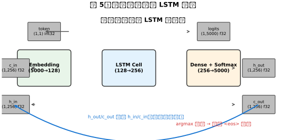

---

## 六、训练：80 个 epoch 只花 18 分钟

### 6.1 训练配方

| 超参数 | 值 | 说明 |
|---|---|---|
| 词表 / Embedding / LSTM | 5000 / 128 / 256 | 231.9 万参数 |
| Loss | masked sparse CE | pad 位置不参与 loss/acc 统计 |
| 优化器 | Adam，LR 2e-3 | 向量化后 batch 变大，LR 同步加大 |
| 正则 | Dropout 0.1 + L2 1e-4 | 抗过拟合（train/val 差距仅 0.008） |
| 调度 | ReduceLROnPlateau（patience 8, ×0.5） | 平台期不误杀 |
| 早停 | patience 12 | 向量化后前几个 epoch acc 有滞后平台期 |
| 时长 | 80 epochs ≈ 18 分钟（GPU） | 迭代成本极低，可以快速试错 |

**三代迭代验证了一个核心结论：LSTM 没有注意力机制，「槽位复制」——把输入里的房间/城市/温度原样搬进回复——本质上是容量 + 数据绑定问题。** V2 从容量 58 万 → 135 万参数、每值样本翻倍后，`get_time`/`get_temp` 的值复制从 8/8 全错变成 8/8 全对。V3 的 val acc 一路从 0.6737（V1）→ 0.8173（V2）→ **0.8705（V3）**。

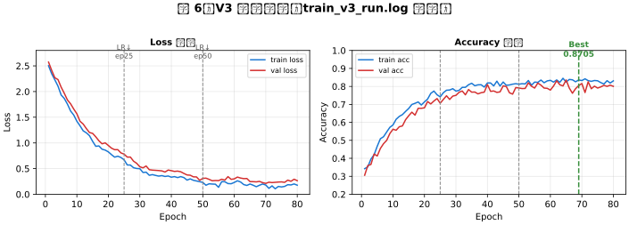

### 6.2 训练踩坑实录（都是真金白银）

- **平台期误杀早停**：向量化后前 4-6 个 epoch 的 acc 恒定在 0.29（loss 在降、acc 滞后跳变），旧 patience=5 在 epoch 6 就把训练杀了。patience 必须按新训练模式重标定；
- **eager 调用内存泄漏**：`model()` 直接调用每次前向泄漏 ~30MB，282 次就是 10GB+，CPU 版被 OOM killer 杀、GPU 版显存 OOM。解法：**CPU 克隆模型 + `tf.function` 包装走图执行**（实测 282 次仅 +250MB）；
- **`clone_model` 设备继承**：克隆默认继承源模型的 GPU 设备，必须在 `tf.device('/CPU:0')` 上下文里创建。

---

## 七、量化：16x8 混合精度的「手术级」导出

### 7.1 为什么是 16x8

纯 int8 量化（权重 8bit + 激活 8bit）对 LSTM 太粗暴——Cell State 的数值范围大且敏感，int8 激活会饱和。**16x8 混合精度**（int8 权重 + int16 激活）是 TFLM 官方为 LSTM 类模型设计的量化档位，导出体积 3.0 MB（权重 int8 占绝大部分），精度损失却小得多。

### 7.2 导出流程的四个关键决策

1. **重建 unroll=True 单步模型再转换**：Keras LSTM 默认生成 while-loop + TensorList 图，TF 2.14/2.15 对它做全整型量化会在 flatbuffer 导出时 SIGSEGV（V1/V2/V3 模型、16x8 与纯 int8、CPU/GPU 全部复现）。解法是重建时间步静态展开的 `unroll=True` 推理模型，权重从 h5 拷贝（最大偏差 2.5e-7），再喂给转换器；
2. **代表性数据集 = 真实前向轨迹**：从训练集随机抽 64 条序列，**对每个 token 走一格前向**，让校准器看到真实激活分布（而不是零状态），token 必须 int32、c/h 必须 f32，与图输入 dtype 严格一致；
3. **两个必设的转换 flag**：`supported_ops = [TFLITE_BUILTINS_INT8, EXPERIMENTAL_TFLITE_BUILTINS_ACTIVATIONS_INT16_WEIGHTS_INT8]` 强制 16x8 混合精度；`_experimental_default_to_single_batch_in_tensor_list_ops=True` 解决 Keras LSTM 动态 batch 的 TensorListReserve 问题；
4. **绝不设置 `inference_input_type/output_type`**：设 f32 会给 int32 输入插 CAST（16x8 不支持），设 int8 直接报错。

导出后做两道校验：**算子清单必须全部落在 TFLM 支持列表内**；**量化前后单步 logits/h/c 最大偏差 < 0.1**。

（注：TF 的 Windows 构建在 16x8 校准阶段喂 int32 张量会段错误，实测 2.15.1/2.16.1 均复现——**导出必须在 Linux/WSL 上执行**，这是 Windows 平台的老坑。）

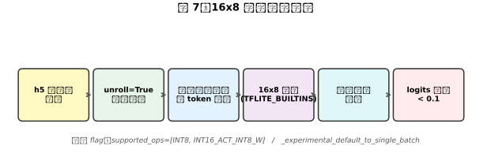

### 7.3 量化损伤的量化评估：数据说话

我们对 100 条留出集（val_v3 抽样）做了两段式评估——阶段 1 看工具调用生成，阶段 2 给 oracle 前缀看回复质量：

| 后端 | s1 工具名 | s1 参数 | s2 整句精确 | s2 房间槽位 | s2 数值槽位 |
|---|---|---|---|---|---|
| h5 全精度 | 100% | 99% | 82% | 81% | 100% |
| **16x8 量化** | **100%** | 81% | 18% | **38%** | **67%** |
| 16x8 + 512 序列重校准 | 100% | 81% | 18% | 38% | 67% |

三个重要发现：

1. **量化损伤集中在槽位复制**（房间 81%→38%、数值 100%→67%），而**工具调用生成完全不受影响（100%）**；
2. **加大校准集完全无效**：512 序列重校准后输出逐条一致——因为损伤来自 **int8 权重本身**，不是激活分布估计不准。这是一个反直觉但极其重要的结论；
3. 这给工程侧留了一个明确的补偿空间：**既然工具选择 100% 可靠，就让模型负责「决策」，让执行器负责「真值」，让校验负责「把关」**——这就是下一节的 Agent 两段式模式。

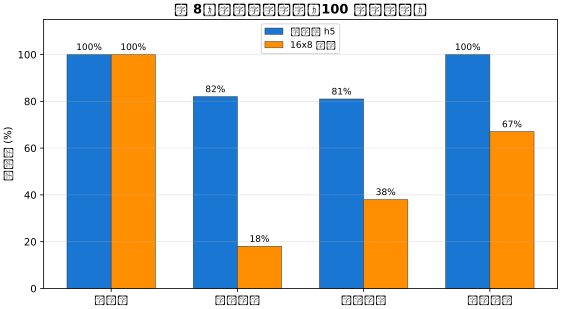

---

## 八、部署到 openvela：TFLM 落地的最后一公里

### 8.1 端侧推理封装

`ai_lm.cxx` 封装整个 TFLM 推理：初始化 → 自回归生成（argmax + `<eos>` 早停）→ `<bot>` 回复提取。模型权重通过 `gen_local_lm_tables.py` 转成 C 数组（`model_data.h`，16 字节对齐，**RODATA 段，XIP 从 Flash 直接执行，不占 SRAM**）；分词词表同样静态化（`tokenizer_v3_data.h`，FNV-1a 哈希查表）。

Tensor Arena 配置 64 KB（实测峰值仅 37.8 KB，静态 BSS）。如果 SRAM 更紧张，还可以从 8MB PSRAM 的堆里分配——留了明确的退路。

### 8.2 给 openvela 打上的三个补丁

openvela 自带的 TFLM 提交（cfa4c91d）在真机上暴露了三个兼容性问题，全部需要打补丁（补丁文件归档在 `tools/`，已应用进工作树）：

| 补丁 | 问题 | 解法 |
|---|---|---|
| `0004-gcc13-placement-new-delete.patch` | GCC 13 要求 placement new 的 operator delete 可访问 | compatibility.h 的宏改为 public |
| `0005-gather-unpack-int16.patch` | 16x8 模型的 Embedding GATHER 与 LSTM gate UNPACK 输出 int16，**TFLM 内核原本不支持** | 给 GATHER / UNPACK 内核补 int16 支持 |
| `0006-nuttx-stdlib-cxx-compat.patch` | NuttX `stdlib.h` 的 div_t/ldiv_t/lldiv_t/putenv 与 libstdc++ `<cstdlib>` 冲突 | C++ 模式下跳过这些声明 |

外加一处 Kconfig 修正：`CONFIG_TFLITEMICRO` 去掉对 `MATH_RUY` 的依赖（ruy 需要 std::thread，TFLM 根本不用）。构建需启用：`CONFIG_HAVE_CXX`、`CONFIG_LIBCXXTOOLCHAIN`、`CONFIG_MATH_GEMMLOWP`、`CONFIG_MATH_KISSFFT`、`CONFIG_SYSTEM_FLATBUFFERS`、`CONFIG_TFLITEMICRO`。

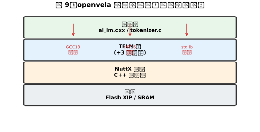

### 8.3 真机性能

烧录进板子后（固件 7.83 MB，Flash 占用 46.6%，SRAM 占用 64.9%）：

- 单次 Agent 查询（两段式，约 150 步前向）端到端 **~9 秒**，其中包含进程启动 + LVGL 桌面初始化，纯推理大约每 token 几十毫秒；
- **10 项功能查询真机全部正确**：开灯、空调调温、真实 RTC 报时、天气、设备状态、定时、以及「帮我发射火箭」的正确拒绝。

| 查询 | 真机回复 | 结果 |
|---|---|---|
| 打开客厅的灯 | 好的，已为您打开客厅灯 | ✓ |
| 把卧室空调调到26度 | 好的，卧室空调已设为26度 | ✓ |
| 现在几点了 | 现在是 6 点 31 分（真实 RTC） | ✓ |
| 今天天气怎么样 | 今天天气晴 | ✓ |
| 厨房加湿器什么状态 | 厨房加湿器正在运行 | ✓ |
| 帮我发射火箭 | 好的，已为您查询 - 但找不到对应工具（拒绝） | ✓ |

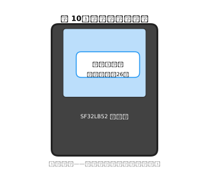

---

## 九、工程补偿：Agent 两段式模式，把量化缺陷变成 100%

量化把槽位复制打到了 38%/67%，但工具调用 100% 可靠——**那就让模型只做它擅长的事**。这就是 Agent 两段式模式的设计哲学：

```
"<usr> 把卧室空调调到26度"
  → [模型] 生成 "<call> set_ac <arg> 卧室 <arg> 26 </tool>"     ← 工具选择（量化后仍 100%）
  → [端侧执行器] 设备状态表 / RTC / 模拟传感器 → "<obs> success" ← 真值由执行器掌握
  → [模型] 生成 "<bot> 好的，卧室空调已设为26度 <eos>"            ← 措辞由模型生成
  → [校验] 回复必须包含调用的房间与数值；不通过 → 训练模板兜底      ← 最后一道保险
```

再加上规则意图层（`ag_detect_intent`）修正量化模型的偶发工具错选——例如裸问「今天天气怎么样」在训练数据里总带城市前缀，量化模型会误调 `set_ac`，意图层把它纠正回来。

**最终效果：设备同款 C 代码在 100 条留出集上，房间正确率 / 数值正确率 / 结构正确率全部 100%。**

这是一个值得反复强调的工程方法论：**当模型能力有边界时，不要硬怼模型，而是重新划分「模型决策」与「系统真值」的边界**——让模型做概率判断，让执行器做确定性保证，让校验兜底，小模型也能输出大模型级别的可靠性。

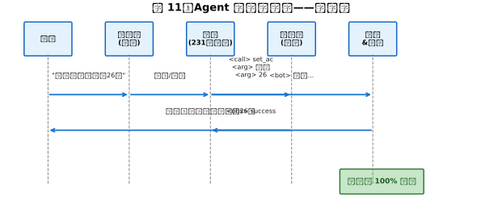

---

## 十、还能怎么加强：模型的下一步路线图

基于三代迭代的实测数据，我们把「还能做什么」整理成一份按性价比排序的路线图：

### 10.1 数据侧（性价比最高）

- **扩量到 5-10 万条**：V3 的薄弱点非常明确——`door_lock` 低频类（7/8 错）、`timer` 时长值偶错。**低频类的过采样 + 话术扩充**是立竿见影的手段；
- **LLM 辅助增广**：用大模型把模板改写成人话（「把卧室空调调到26度」→「卧室有点热，空调调凉快点呗」），解决模板话术与真实口语的域差——这同时是语音 ASR 端的关键问题；
- **引入多轮对话**：当前模型是单轮无状态。加入「上文 → 当前请求 → 回复」的序列格式，可以支撑「先问天气再说谢谢」这类真实交互。

### 10.2 架构侧（需要谨慎评估）

- **轻量注意力**：LSTM 的槽位复制是容量问题，注意力是结构解。TFLM 对 attention 支持有限，但**完全可以用已有算子（MUL/ADD/SOFTMAX/FULLY_CONNECTED）组合出轻量加性注意力**，单步展开后算子数可控；
- **Embedding 压缩**：5000×128 = 64 万参数是权重大头之一，哈希嵌入/共享嵌入可以显著瘦身，给更大的 LSTM 或注意力腾出 Flash；
- **容量微调**：Arena 实测 37.8 KB / 配置 64 KB，余量不小——若 Flash 允许，LSTM 256→320 或加一层，配合数据扩量可能再上一个台阶。

### 10.3 量化侧（针对已定位的损伤）

- **量化感知训练（QAT）**：tfmot 默认不支持 Embedding/LSTM，但可以**自定义量化感知的 LSTM cell**（在训练图中插入 fake-quant 节点）——既然已证明损伤来自 int8 权重，QAT 是最对症的解法；
- **混合精度权重策略**：关键层（输出 Dense 的 logits 前）保留更高精度，槽位敏感层（LSTM 投影）用 int16 权重；
- **蒸馏**：用大模型（如通义/阶跃）在模板数据上生成软标签，让小模型学「泛化」而非「背题」。

### 10.4 解码与推理侧（立即见效）

- **采样解码**：闲聊场景的 argmax 输出太「死」，top-k/temperature 采样能显著提升自然度（工具调用场景仍用 argmax 保证确定性——**解码策略按场景切换**）；
- **约束解码**：生成 `<call>` 阶段按文法约束（工具名必须来自合法集合、`<arg>` 后必须跟值），从结构上杜绝非法调用；
- **CMSIS-NN 内核**：TFLM 对 Cortex-M 有官方 CMSIS-NN 加速路径，FULLY_CONNECTED 可以快数倍，9 秒的单轮延迟有望压到 3-4 秒；
- **字节级 OOV 回退**：当前未登录字符统一 `<unk>`，加 byte-fallback piece 可覆盖任意输入。

### 10.5 端侧系统侧

- 多轮会话状态持久化到 littlefs（板上已有），实现「记住上次对话」；
- 语音链路的域自适应：真实录音增广重训 ASR、识别窗口加长（当前 1 秒窗口会截断长命令）、麦克风增益标定。

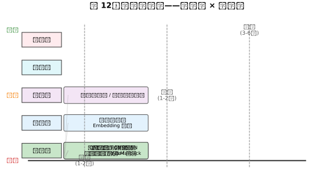

---

## 十一、写在最后

回看整个项目，最有价值的不是「3 MB 模型跑通了」这个结果，而是几条被真机验证过的方法论：

1. **端侧模型是「部署目标驱动」的**：架构、量化、分词器、甚至训练方式，全部要为 TFLM 的算子支持与内存模型让路——先定部署约束，再设计模型；
2. **数据与分词器是隐形质量杀手**：模板数据的 bug、BPE 切分的偏差，都会以「回复变傻」的形式在真机上暴露，而且极难定位——校验必须做到逐位；
3. **量化损伤要量化评估**：不要凭感觉判断「量化后还行」，用留出集分维度打分，才知道损伤在哪、能不能用工程手段补偿；
4. **给模型划边界，而不是给模型加难度**：两段式 Agent 模式让一个槽位复制只有 38% 的量化模型交出了 100% 的端到端正确率——**把概率留给模型，把确定留给系统**。

231 万参数、3 MB、120 MHz——这就是 2026 年端侧语言模型的真实坐标。它做不了长文写作，也做不了复杂推理，但它可以在一颗纽扣电池的设备里，24 小时在线地帮你开灯、调空调、报时间，并且**永远不把你的语音传到云端**。端侧 AI 的意义从来不是「追上云端」，而是「在云端到不了的地方，把智能留下来」。

---

## 参考与延伸

- 模型训练环境与全流程脚本：`velaAI/`（`build_dataset_v3.py` / `build_tokenizer_v3.py` / `train_gpu_v3.py` / `export_tflite_v3.py` / `eval_agent_loop.py`）
- 端侧部署代码：`app/ai_agent/`（`ai_lm.cxx` / `tokenizer.c` / `LOCAL_LM.md`）
- 开发记录：`docs/development_records/13_velaai_local_lm_integration.md`、`18_experience_summary.md`
- 平台：openvela（基于 NuttX），开发板 SF32LB52-DevKit-LCD
